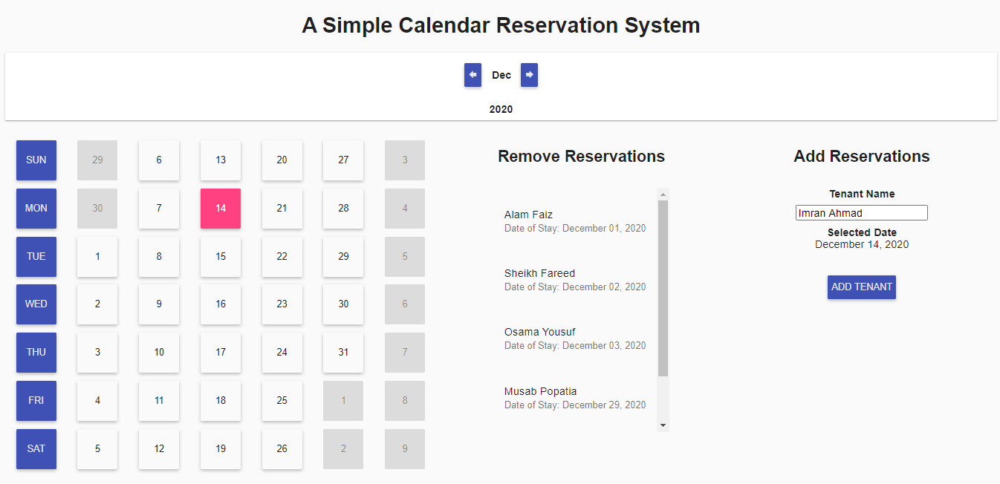
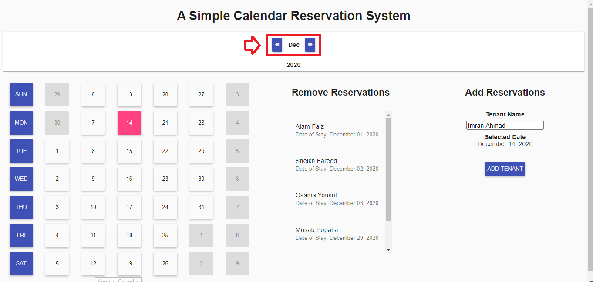
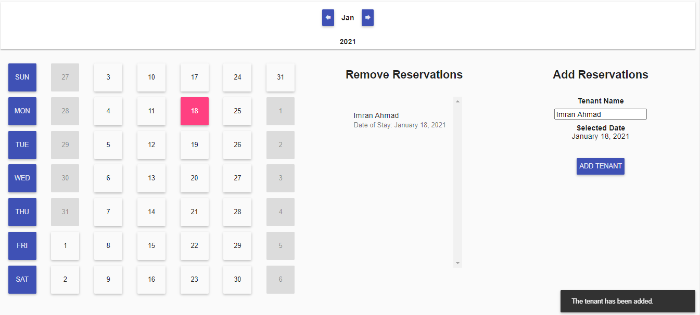
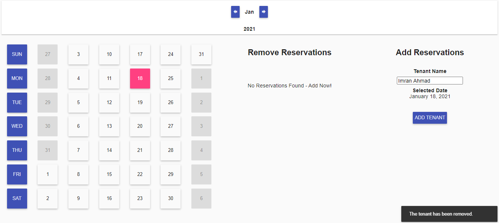

# Angular-Calendar

- Technical Assignment - a part of Stellic's hiring Process.
- To Code a Calendar Reservation System without external libraries.

## Dependencies

Dependency | Purpose
-- | --
[AngularJS 1.4.0](https://code.angularjs.org/1.4.0/) | Core frontend framework
[AngularJS Material](https://material.angularjs.org/latest/) | Laying out template UI
[MomentJS](https://momentjs.com/) | Simpler daytime calculations

## Instructions to Launch

- Start the server via `npm start` while in the server directory.
- None of the dependencies require explicit installation.
- Launch `main.html` from the root directory in any modern browser*.

## File Structure

File Type | Directory
-- | --
Server | `/Server/` (`server.js` has been tweaked**)
JavaScript | `/js/` 
Style | `/styles/` 
Html | Root Directory `(./index.html)`
Image | `/images/` (Contains Images for this Repo)

*Detailed comments are included in each file accordingly for clarity*. 

## Functionality

##### Month Navigation

- Use the month chevrons in the navigation bar.
- The same can be used for toggling to next or previous years (for example, pressing next on December at any given year takes you to the January of the next year).

##### Add Tenants

- Navigate to the required month.
- Select the appropriate day from the calendar view (days are clickable - change should be reflected in the `Add Tenant` Pane).
- Enter a name for the tenant in the corresponding field, and press the `ADD TENANT` button.
- Click on the `Proceed` button on the confirmation dialog box once prompted.
- If no errors were encountered, the new tenant will be displayed in the tenant list in the `Remove Tenants` pane.

##### Remove Tenants

- Navigate to the required month.
- Click on the tenant that is to be removed from the `Remove Tenants` pane.
- Click on the `Remove` button on the confirmation dialog box once prompted.
- If no errors were encountered, the selected tenant will have been removed and won't be displayed in the tenant list in the `Remove Tenants` pane.

## Edge Cases

The following edge cases have been robustly tested and error handling has appropriately been done.

- Client is started when the server is down, querying fails.
- Client is querying the server and the server goes down, querying fails.
- A tenant is being added to a day in which another tenant has already made a reservation in some other window, an error is presented and the view is refreshed.
- A tenant is being removed from a day that was already removed in some other window, an error is presented and the view is refreshed.
- A tenant is added to a day that's already booked, appropriate error is presented again.

## Guides Used

- *Course*: SPA Web Applications with Angular JS - [Coursera](https://www.coursera.org/learn/single-page-web-apps-with-angularjs/home/welcome)
- *Guide*: AngularJS Official [Material Demos](https://material.angularjs.org/1.1.22/demo) 
- Random Stack Overflow questions

## Restrictions/Assumptions

- By design, a day can only be booked by a single tenant at a given time.
- There were a few duplicate reservations (same day) in the file the backend is serving. For example, `"Marianna Gregory"` appears twice based on the current set  timezone. 
- This duplicate issue can be been catered by manipulating/syncing client/server timezone, but has been left as is for purposes of this task to keep things simple.
- Chrome's console gives a passive event listener warning. It's a [known](https://github.com/angular/angular.js/issues/15901) compatibility issue of modern browsers with old versions of AngularJS.
- Reservations can be made in past dates as well.

## *Tested On
- Chrome
- Firefox

## **Tweaks in Server Files

- In the `app.post('/reserve')` method, the logic of removing a tenant from the list of reservations has been tweaked.
- Previously, if a day had multiple reservations [1], the method would get rid of all reservations from that particular day.
1.  While the frontend design doesn't allow a day to have multiple reservations, the backend might contain such instances - as highlighted in the second point of the `Restrictions` section earlier in the `README`.
1. This change ensures that removing one of the entries on a day with multiple reservations only removes the intended reservation to be removed.
- Now, it will only remove a single instance with which both the inputs, `tenant name` as well as `time` match exactly.
- This change can be seen in Lines [101-104] of the `server.js` file.
